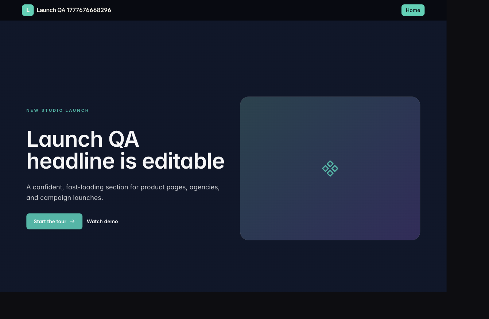

# Blockloom Progress Report

<p align="center">
  
</p>

<p align="center">
  <strong>CSE226 · Spring 2026</strong><br />
  <strong>Student:</strong> Rajin Khan (`@rajin-khan`)<br />
  <strong>NSU ID:</strong> 2212708042
</p>

<p align="center">
  
</p>

---

## Executive Summary

**Blockloom** is a multi-page visual website builder. Authenticated users can create isolated workspaces, compose websites from reusable blocks, manage drafts, publish public pages, and store structured content through SELISE Blocks services.

The project is implemented as a React/Vite frontend with SELISE Blocks IAM, Data Gateway, and Storage/Media integration. A local demo fallback is included so the editor can be evaluated quickly without requiring a cloud login.

Demo video: [BlockLoom Demo.mp4](https://drive.google.com/file/d/1i8G2NsF6rU3TOiz0Xzh21VPIilmp1Q1R/view?usp=sharing)

## Requirements Coverage

| Requirement area | Status | Evidence |
| --- | --- | --- |
| User authentication | Done | Login/signup routes, IAM integration, demo fallback. |
| User workspace isolation | Done | Owner-scoped website, page, and asset records. |
| Multi-page websites | Done | Create, rename, navigate, publish, and render pages. |
| Drag-and-drop editor | Done | Canvas, palette, layers panel, inspector, context actions, undo/redo. |
| Component library | Done | 57+ editable block types. |
| JSON layout persistence | Done | Draft and published layout payloads. |
| Media support | Done | Storage/Media upload path and asset metadata model. |
| Public renderer | Done | Clean `/site/:siteSlug/:pageSlug` routes without editor chrome. |
| Deployment readiness | Done | Vite static build and deployment documentation. |

## Product Screens

### Workspace

<p align="center">
  
</p>

### Editor

<p align="center">
  
</p>

### Editing A Hero Block

<p align="center">
  
</p>

### Published Site

<p align="center">
  
</p>

## Architecture

| Layer | Implementation |
| --- | --- |
| Frontend | React 19, Vite, TypeScript, Tailwind CSS. |
| UI primitives | Radix UI, custom Blockloom editor components. |
| Drag/drop | `@dnd-kit`. |
| State/data | TanStack Query, local editor store, SELISE Data Gateway. |
| Auth | SELISE IAM with local demo fallback for development. |
| Media | SELISE Storage/Media flow with asset metadata. |
| Testing | Vitest and Testing Library. |

## Verification

Recommended final checks:

```bash
npm run lint
npm run build
npm test -- --run
```

## Submission Contents

| Item | Path |
| --- | --- |
| Product README | [`../README.md`](../README.md) |
| Submission index | [`submission.md`](submission.md) |
| Installation guide | [`installation.md`](installation.md) |
| Deployment guide | [`../DEPLOYMENT.md`](../DEPLOYMENT.md) |
| Screenshots | [`assets/`](assets/) |
| Demo video link | [`VIDEO_LINK.txt`](VIDEO_LINK.txt) |
| Codex transcript | [`../chat-logs/codex-side.md`](../chat-logs/codex-side.md) |
| Cursor transcript | [`../chat-logs/cursor-side.md`](../chat-logs/cursor-side.md) |

## Closing Note

Blockloom aims to feel like a real product rather than a technical demo: a focused workspace, a responsive builder, polished brand assets, and a clean published-site experience.
