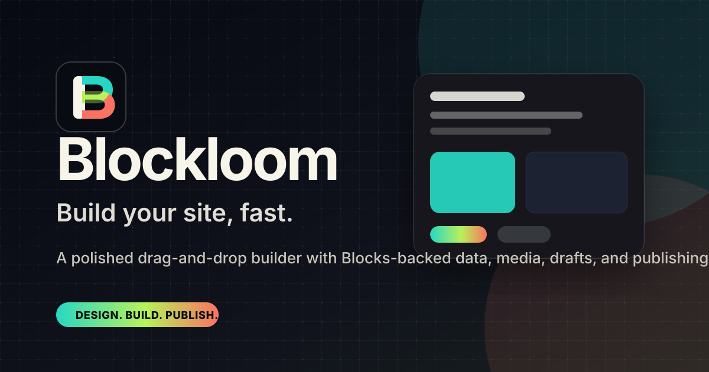
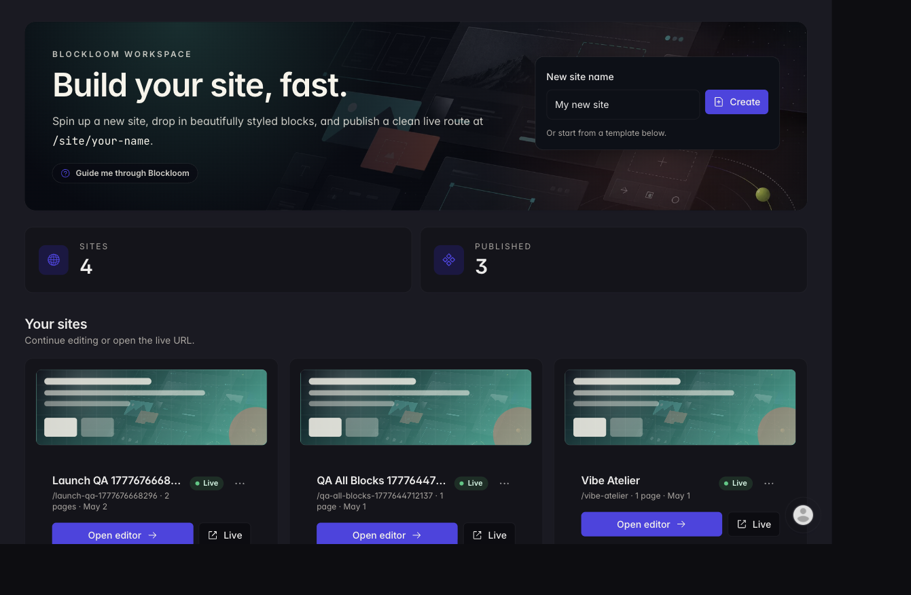
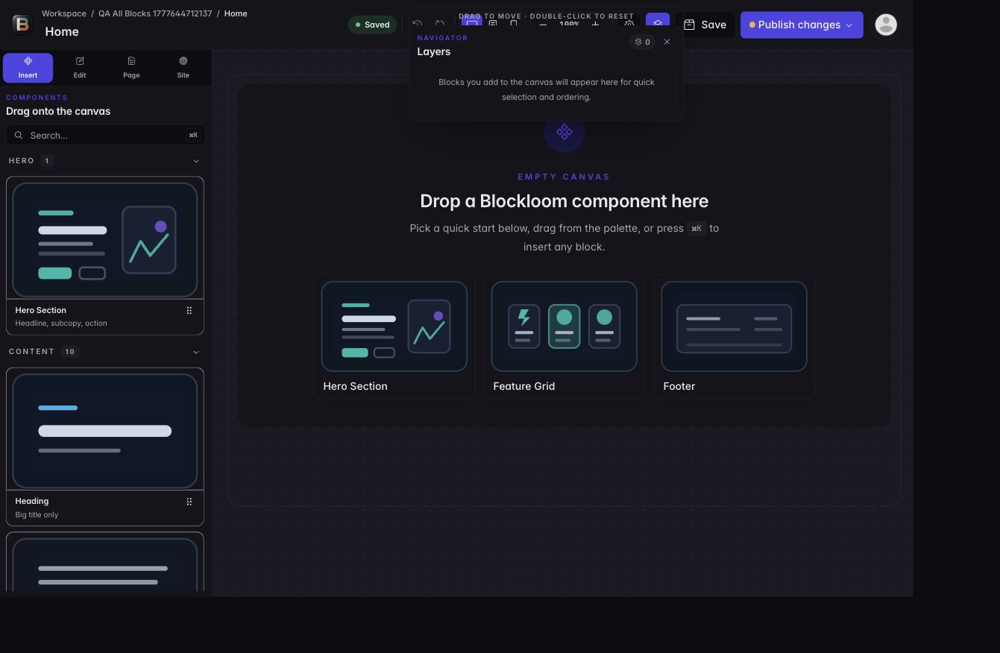

<p align="center">
  
</p>

<h1 align="center">Blockloom</h1>
<h3 align="center">Progress report</h3>

<p align="center">
  <strong>CSE226 · Spring 2026</strong><br />
  <strong>NSU ID:</strong> 2212708042<br />
  <a href="https://github.com/rajin-khan">Rajin Khan</a> (<code>@rajin-khan</code>) ·
  <a href="https://github.com/rajin-khan/VibeBuilder">github.com/rajin-khan/VibeBuilder</a>
</p>

<p align="center">
  
</p>

---

## Executive summary

**Blockloom** is a multi-tenant-style visual site builder: authenticated users get an isolated workspace, a drag-and-drop editor with a large block library, persisted JSON layouts and media, and a **separate public renderer** for published pages. This document maps delivery to the course brief and lists submission artifacts. **Demo video** and **full tool transcripts** are supplied per instructor instructions. The author is **not** submitting any **PDF** artifacts — this report, [`submission.md`](../submission.md), and related docs are **Markdown** (plus images in `docs/assets/`).

---

## Requirements coverage

### Identity & workspace

| Requirement | Status |
| --- | ---: |
| Hosted sign-up / sign-in | Done |
| Per-user isolation for sites and pages | Done |
| Multiple pages per site (create, name, remove) | Done |

### Editor

| Requirement | Status |
| --- | ---: |
| Rich component library | Done — **57+** block types |
| Drag, reorder, live property editing | Done |
| Layout stored as structured JSON | Done (draft + published payloads) |

### Data & media

| Requirement | Status |
| --- | ---: |
| No local SQL / Firebase as primary store | Done — hosted APIs + schemas |
| Flexible page payload | Done |
| Image upload and durable URLs in layouts | Done |
| Autosave / persistence | Done |

### Published experience

| Requirement | Status |
| --- | ---: |
| Distinct “live” view vs editor | Done |
| Public URL pattern `/site/:siteSlug/:pageSlug` | Done |
| Multi-page navigation on live site | Done |

---

## Product visuals

Brand lockup (favicon + social card) appears at the top of this document. Key **in-app** captures:

<p align="center">
  <br />
  <em>Workspace — sites and templates</em>
</p>

<p align="center">
  <br />
  <em>Editor — canvas, palette, inspector</em>
</p>

<p align="center">
  <br />
  <em>Published site — visitor view</em>
</p>

Additional PNGs under `docs/assets/` are available for appendices or slides.

---

## Architecture

- **Client:** React 19, Vite, TypeScript, Tailwind, Radix UI, TanStack Query, `@dnd-kit`.
- **Models:** Websites, pages, and assets persisted via the platform GraphQL gateway; optional **demo** fallback to `localStorage` for local development.
- **Output:** Static SPA in `build/`; container and cloud deploy documented in [`DEPLOYMENT.md`](../DEPLOYMENT.md).

---

## Verification

```bash
npm run lint
npm run build
npm test -- --run
```

See the root [`README.md`](../README.md) for the latest reported test counts.

---

## Submission bundle (this repo)

| Item | Location |
| --- | --- |
| Source | Repository root |
| Submission index | [`submission.md`](../submission.md) (start here for course grading) |
| Install / run (detailed) | [`installation.md`](../installation.md) |
| Product overview | [`README.md`](../README.md) |
| Deploy / ops | [`DEPLOYMENT.md`](../DEPLOYMENT.md) |
| This report | `docs/PROGRESS_REPORT.md` |
| Screenshots | `docs/assets/*.png` |
| AI interaction logs | `chat-logs/codex-side.md`, `chat-logs/cursor-side.md` |
| Video URL | *Author adds in course submission zip* |

---

## Closing

Blockloom is meant to feel like a **real product**: calm onboarding, a focused studio, and a clean public site. Thank you for reviewing.

— **Rajin Khan** (NSU ID **2212708042**) · [@rajin-khan](https://github.com/rajin-khan)
