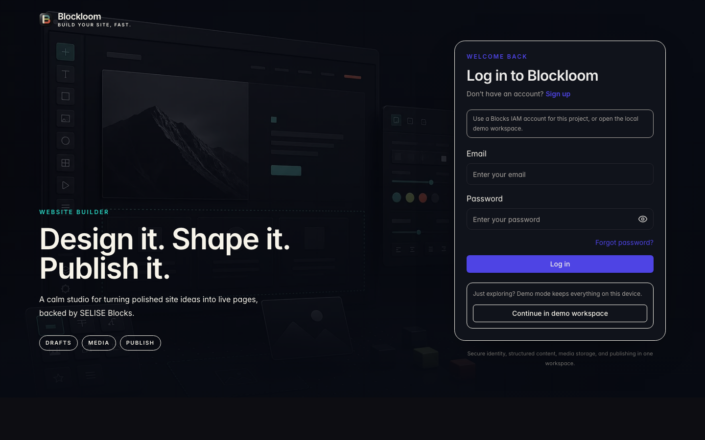
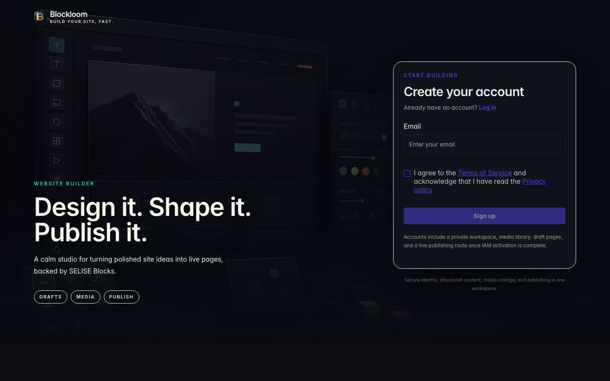
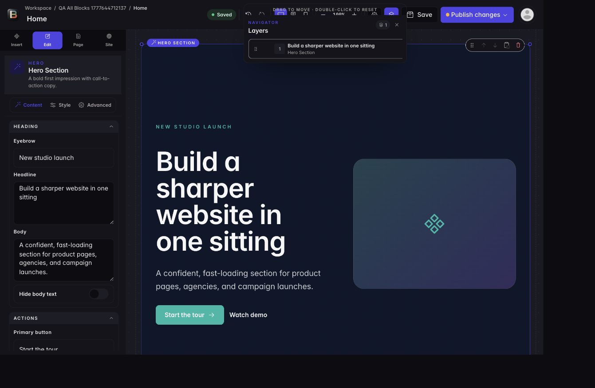

# Blockloom — Progress Report

**CSE226 Section 1 · Spring 2026**

| | |
| --- | --- |
| **Author** | [Rajin Khan](https://github.com/rajin-khan) (`@rajin-khan`) |
| **Repository** | [github.com/rajin-khan/VibeBuilder](https://github.com/rajin-khan/VibeBuilder) |
| **Product** | **Blockloom** — drag-and-drop website builder (Vite + React) |

---

## 1. Executive summary

Blockloom is a **multi-page site builder** that meets the Selise Blocks project brief: users sign in (IAM), work in a **private workspace**, compose pages from a **large block library**, persist **JSON layouts** and media through **Data Gateway and storage APIs**, and **publish** a **public** site at `/site/:siteSlug/:pageSlug` separate from the editor.

This report summarizes **what is complete**, how it maps to the brief, and what artifacts ship with the repository. **Demo video** and **full LLM/chat transcripts** are prepared outside the repo per course instructions.

---

## 2. Alignment with the project brief

### 2.1 Tenant & user management

| Requirement | Status |
| --- | ---: |
| User registration / sign-in via Blocks IAM | Done |
| Workspace isolation (user sees only their sites) | Done |
| Multi-page sites: create, name, delete pages | Done |

### 2.2 Drag-and-drop editor

| Requirement | Status |
| --- | ---: |
| Block library (heroes, text, media, galleries, forms, etc.) | Done — **57+** configurable block types |
| Drag, reorder, edit properties in real time | Done (`@dnd-kit`, inspector, undo/redo) |
| Layout serialized to JSON and saved | Done (draft + published payloads on `VibePage`) |

### 2.3 Content & asset persistence

| Requirement | Status |
| --- | ---: |
| Site structures stored via Blocks services (no local SQL/Firebase) | Done (`VibeWebsite`, `VibePage`, `VibeAsset`) |
| Flexible JSON for page layout | Done |
| Images uploaded via storage / presign flow | Done |
| Autosave / persist so work is not lost | Done |

### 2.4 Live site renderer

| Requirement | Status |
| --- | ---: |
| Publish vs editor separation | Done |
| Public routes | Done — `/site/...` |
| Navigation between user-created pages | Done |

---

## 3. Visual walkthrough

### 3.1 Identity & workspace

<p align="center">
  
</p>

<p align="center">
  
</p>

<p align="center">
  
</p>

### 3.2 Editor

<p align="center">
  
</p>

<p align="center">
  
</p>

### 3.3 Published site

<p align="center">
  
</p>

---

## 4. Architecture (concise)

- **Frontend:** React 19, Vite, TypeScript, Tailwind, Radix UI, TanStack Query.
- **State:** Builder and server state coordinated through hooks and services; demo mode uses `localStorage` when gateway schemas are unavailable locally.
- **APIs:** GraphQL Data Gateway for websites, pages, assets; IAM for auth; HTTP client patterns for storage upload.
- **Deployment:** Static `build/` output; Docker and **Blocks Cloud** deployment documented in [`DEPLOYMENT.md`](../DEPLOYMENT.md).

---

## 5. Quality & testing

Repo includes ESLint, production build, and Vitest + Testing Library. Before submission, maintainers ran:

```bash
npm run lint
npm run build
npm test -- --run
```

(Test counts may change as the suite evolves; see root [`README.md`](../README.md) for the latest figures.)

---

## 6. Deployment & configuration

- Environment variables: see [`.env.example`](../.env.example) and [`DEPLOYMENT.md`](../DEPLOYMENT.md).
- **Public reads:** Anonymous `/site/...` uses `getVibeWebsites` / `getVibePages` with project key when **View** is **Public** on those schemas (see deployment guide).

---

## 7. Submission checklist (this repo)

| Artifact | Location |
| --- | --- |
| Source code | Repository root |
| Install / run instructions | [`README.md`](../README.md) |
| Deploy notes | [`DEPLOYMENT.md`](../DEPLOYMENT.md) |
| **This progress report** | `docs/PROGRESS_REPORT.md` |
| Screenshots | `docs/assets/*.png` |
| Video link | *To be added by author in Canvas zip* |
| Interaction history | *To be added by author in Canvas zip* |

---

## 8. Closing note

Blockloom is intended to read as a **cohesive product**: calm auth shell, fast workspace, deep editor, and a clean public renderer. Thank you for reviewing the work.

— **Rajin Khan**, [@rajin-khan](https://github.com/rajin-khan)
